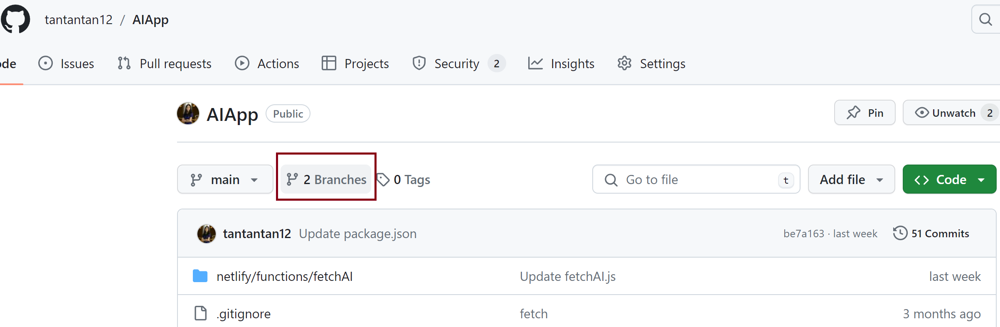
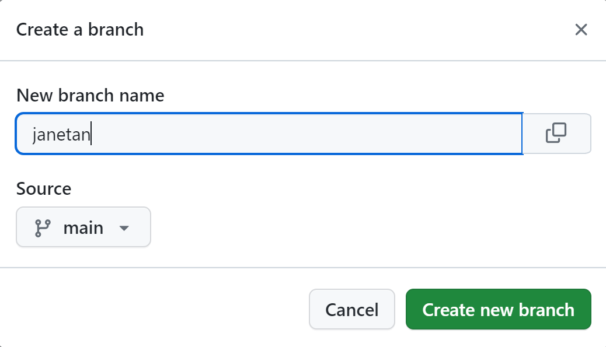
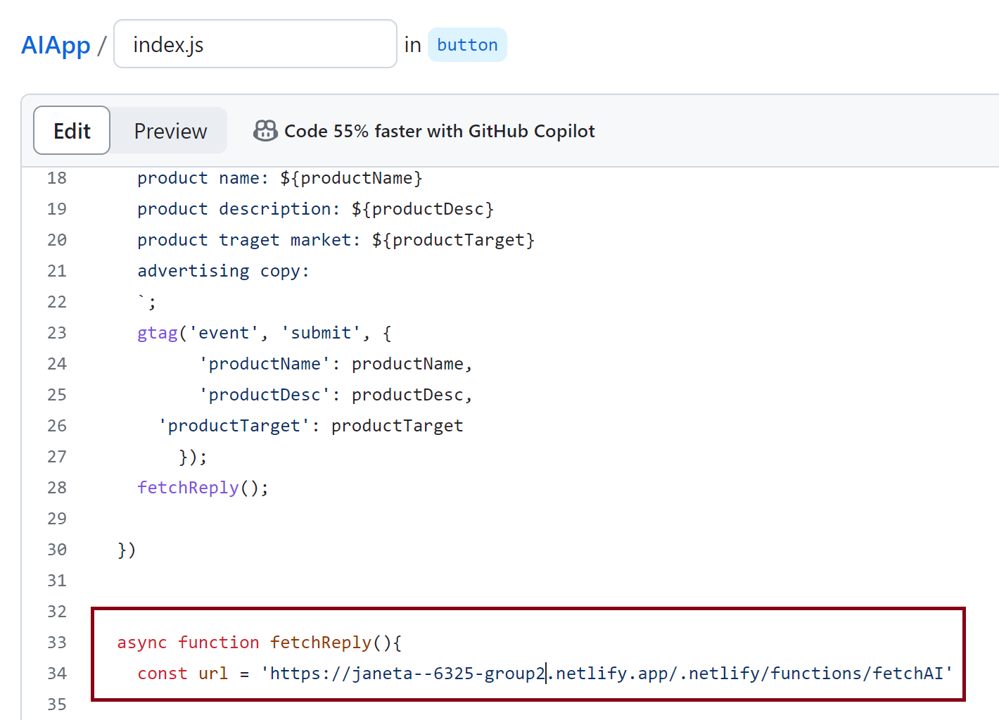
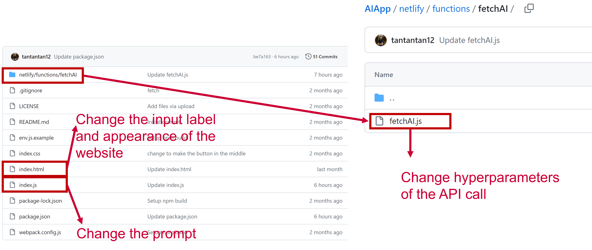

## 1. Welcome 

Welcome to your group AI application template repository!
A repository is a place where you can store your code, your files, and each file's revision history. Repositories can have multiple collaborators and can be either public or private.

Any changes you make here will be reflected in your group project URL: https://6324-group1.netlify.app/

## 2. Create Your Own Branch
What if you want to create your own version of the application without affecting the main version? Branches allow you to develop features, fix bugs, or safely experiment with new ideas in a contained area of your repository. You always create a branch from an existing branch. Typically, you might create a new branch from the default branch of your repository.

Click the "Branch" link.



You can generate a branch and name it with your SMU ID. For me, my SMU ID is janetan, and I can create my branch "janetan" that sources from the main branch. 


If my group URL is https://6325-group2.netlify.app/, I will be able to visit my own version of the application via this link: https://janetan--6325-group2.netlify.app/ (This link does not open because it is hypothetical!)

It is basically the team link with your SMU ID and two hyphens at the beginning. 
To make your application work, you will further need to change index.js in your own branch by adjusting the URL:



> In Homework 1, you will be asked to upload the link of your own branch.

## 3. Customize Your AI Application
Students are assigned to different teams, and every team shares one Github repository that has your AI application template in it. Since you are visiting this page, I assume that you already have a GitHub account and were assigned to your group.

When accessing your Github repo, you will see the following file structure:


 
Below is a tutorial about the customization process.
### 3.1 Change the Prompt
The prompt can be changed in the file index.js.

```js
document.getElementById("submit-btn").addEventListener("click", () => {

  const productName = document.getElementById("name").value;
  const productDesc = document.getElementById("desc").value;
  const productTarget = document.getElementById("target").value;
  prompt += `Use a product name, a product description and a target market to create advertising copy for a product.
  ###
  product name: EcoPure Hydration Bottle
  product description: A sustainable, vacuum-insulated water bottle that keeps drinks cold for 48 hours and hot for 24 hours. 
  product target market: environmentally conscious consumers
  advertising copy: "Stay refreshed and make a difference with the EcoPure Hydration Bottle – the last water bottle you'll ever need. Embrace the power of sustainability with our innovative design, crafted for the eco-warrior in all of us. Whether you're climbing mountains or navigating the urban jungle, keep your drinks ice-cold or steaming hot, all day long. Join the EcoPure movement and quench your thirst for change. #DrinkSustainably #EcoPureAdventure
  ###
  product name: ${productName}
  product description: ${productDesc}
  product target market: ${productTarget}
  advertising copy: 
  `

```
### 3.2 Change the Hyperparameters
The hyperparameters can be changed in the file netlify/functions/fetchAI/fetchAI.js.


```js
import { Configuration, OpenAIApi } from 'openai'

const configuration = new Configuration({
    apiKey: process.env.OPENAI_API_KEY,
})

const openai = new OpenAIApi(configuration)

const handler = async (event) => {
    
    try {
        const response = await openai.createCompletion({
            model: 'gpt-3.5-turbo-instruct',
            prompt: event.body,
        presence_penalty: 0,
        frequency_penalty: 0.3,
        max_tokens: 100,
        temperature: 0,
        })
        return {
            statusCode: 200,
            body: JSON.stringify({
                reply: response.data                

            })
        }
    } catch (error) {
        return { statusCode: 500, body: error.toString() }
    }
}

module.exports = { handler }

```
### 3.3 Change the Design of the Website
#### 3.3.1 Change the headlines
You can change the headlines by modifying index.html

```html
<section class="intro">
			<h1>Promotion Copy Assistant</h1>
			<h2>Get promotional <strong>copy</strong> for your products <strong>fast</strong></h2>
			<p>Powered by AI🤖</p>
		</section>
```

#### 3.3.2 Change the button
If you would like to change the style of the button (or anything else), you should change it in the index.css by adding the following:

```css
button:hover {
      background:#59C3C3;
      transition: 0.7s;
  
  }
```

#### 3.3.3 Change the field label
You can change the input label "Product Name" and the placeholder "Water Bottle". It is important to note that the id for the first input is "name". This will not be shown to your audience but will be used in index.js when generating prompts.
```html
<section class="ad-input" id="ad-input">
			<label for="">Product Name</label>
			<input type="text" placeholder="Water Bottle" id="name">
			<label for="">Description</label>
			<textarea placeholder="Extra big water bottle to cope with the Texas heat" id="desc"></textarea>
			<label for="">Target market</label>
			<textarea placeholder="College students who go to Southern Methodist University" id="target"></textarea>
			<button id="submit-btn">Generate Copy</button>
		</section> 
```
